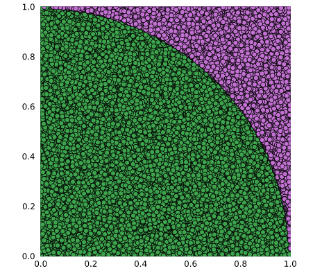

# Monte Carlo simulation in Julia

This repository shows how to use Julia to calculate approximation of PI using Monte Carlo simulation.

Note: This is very ineffective way of calculating PI and I have created only for the purpose of explaining the basics of the Monte Carlo method.

## Running

I would encourage you to run in within VS Code with Julia plugin installed, so you will be able to see the picture showig randomly selected points used in calculation.



```julia
julia> print("PI = $(myPI)")
PI = 3.14216
```
